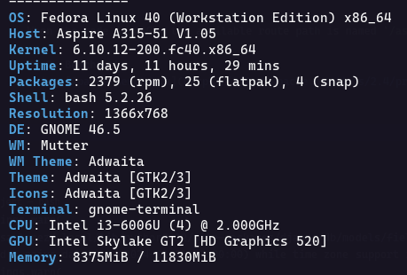
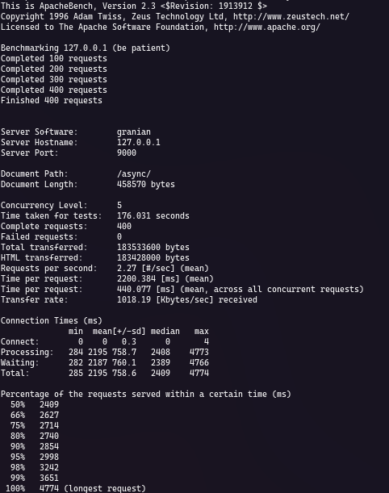
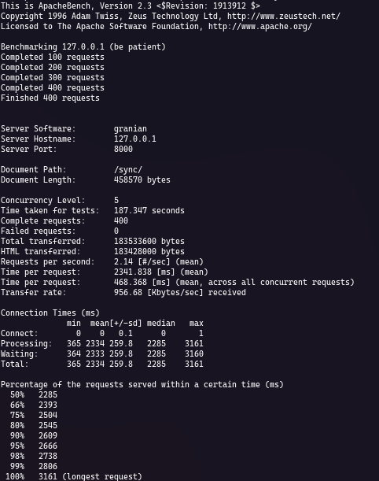
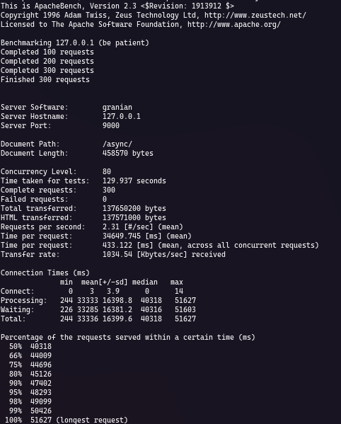

# Django benchmark either ASGI and WSGI

> [!IMPORTANT]
> I'll expand on this and implement improvements that specifies better results.

Hello everyone, I'm exited for share this small project with the purpose of compare synchronus and asynchronus modes in Django.
The goal is compare ASGI and WSGI interfaces for know the really performance and advantages between both; the results are awesome.
So, does ASGI improve or not in Django and whether it's really worth, it's a question that keeps me up at night.
Django is a very popular web framework for python. Since its third version (3.1 exactly) embraced asynchronus support,
however, the bigger disadvantage using ASGI is the large amount of code that is incompatible in libreries and another frameworks
as Rest Framework and even Django's own code like as django.forms and django.contrib.admin packages.
More modern frameworks and technologies like Nest.js, includes natively asynchronus support,
this is so important because them offers concurrency and, this is a big advantage in distributed systems like web applications/services.

In the project folder is the django project configured for run ASGI and WSGI. You can modify this by changing the value of the `USE_ASGI` variable in the settings.py file.
The main funcionality is show all users rendering a template.
In the project, the benchmark application includes a migration that insert 1000 fake users from a JSON file generated in [Mockaroo](https://www.mockaroo.com/)
The server used is [Granian](https://github.com/emmett-framework/granian), is a robust HTTP/HTTP2 server written in RUST for serve python applications.

## 1. Run

For execute the application, first change the `USE_ASGI` variable in the [settings](./project/project/settings.py) file to True or False for run ASGI or the WSGI mode respectively.
Then, in console, stand up the server. Ensure that you are using the correct python path that includes the granian package. Example:

If you gonna serve ASGI, then:
```console
python -m granian --interface asginl project.asgi:application
```
You can specify the workers, the threads and the port:
```console
python -m granian --interface asginl project.asgi:application --workers <WORKERS> --threads <THREADS> port <PORT>
```
Else, for WSGI:
```console
python -m granian --interface wsgi project.wsgi:application
```

When the mode is ASGI, the available route path is named `/async/`, `/sync/` for WSGI.

## 2. Benchmark
Using [Apache Benchmark](https://httpd.apache.org/docs/2.4/programs/ab.html) the in the specified machine,
with a quantity of 400 requests with a concurrency of 5 and, 4 workers and 6 threads for ASGI, the results are:

* Machine:


* Bench for ASGI:


* Bench for WSGI:


And, with 300 requests with high level concurrency of 80, the WSGI server has timeout problems, otherwise, for ASGI mode with same threads and workers, the results are:

* Bench for ASGI:


## 3. Conclusion

Is advantage of using ASGI over WSGI in waiting times and concurrency, is evident. However, it is highly recommended use alternatives that allows improve the concurrency level, such as microservices, replicas, and load balancers along with technologies that support asynchronus operations and avoid blocking code.
